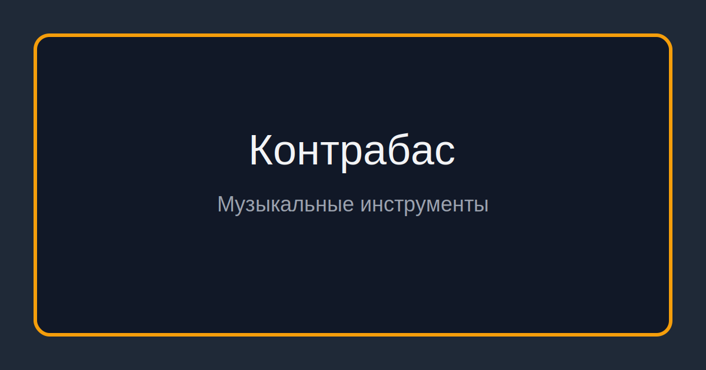

# Контрабас

**Контрабас** — важный музыкальный инструмент, который используется в обучении, концертной практике и студийной записи.

## Краткая история

Контрабас сформировался в XVII–XVIII веках и занял роль самого низкого струнного инструмента оркестра. В классике он укрепляет гармонический фундамент, а в джазе стал самостоятельным выразительным голосом. В XX веке появились развитые сольные школы и виртуозный репертуар.

## Где используется

Наиболее часто контрабас встречается в следующих направлениях:

- симфоническая музыка, камерные ансамбли, джаз, рокабилли, современная музыка

## Особенности инструмента

- низкий, объёмный тембр
- игра смычком и щипком (pizzicato)
- важная ритмическая и гармоническая функция
- крупный размер требует особой постановки тела

## Роль в ансамбле и оркестре

В ансамбле контрабас может выполнять разные функции: вести основную мелодию, поддерживать гармонию, формировать ритм или добавлять тембровый акцент. Конкретная роль зависит от жанра, состава коллектива и аранжировки.

## Советы начинающим

- настройте высоту инструмента так, чтобы левая рука не перенапрягалась;
- чередуйте pizzicato и смычок для комплексного развития техники;
- тренируйте ровный «walking» под метроном на медленных темпах;
- следите за расслабленной спиной: на контрабасе осанка особенно важна.

## Интересные факты

- в джазе контрабас формирует walking bass
- струны и высота подставки сильно влияют на удобство игры

## Связанные статьи

- [Виолончель](./cello.md)
- [Туба](./tuba.md)
- [Бас-гитара](./bass_guitar.md)

## Авторы

- Автор: Мишин Сергей

*Использованные нейросети: GPT-5.2-Codex.*
